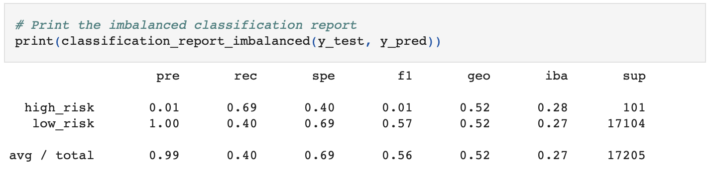

# Credit_Risk_Analysis

# Overview of the loan prediction risk analysis:
### Purpose
The purpose of this challenge was to use resampling methods to alter an unbalanced dataset with the goal of creating a more reliable machine learning model. 

Our dataset classifies datapoints as being either high-risk or low-risk credit loans. In our original dataset the low-risk loans greatly outnumber the high-risk loans. This skew in the dataset target results could cause skewness in future predictions using this model. The model may favor the low-risk classification and wrongfully classify high-risk loans as “low risk.” To correct this issue we need to resample the dataset so the two classification counts are more even. 

### Methods 
There are six resampling methods used in this challenge to achieve our goal: RandomOverSampler, SMOTE, ClusterCentroids, SMOTEENN, BalancedRandomForestClassifier, and EasyEnsembleClassifier.

RandomOverSampler and SMOTE are oversampling techniques; methods that increase the amount of datapoints of the minority classification. 
ClusterCentroids and BalancedRandomForestClassifier are under sampling techniques; methods that decreases the amount of datapoints of the majority classification. 
SMOTEENN is a technique that involves both oversampling and undersampling.
EasyEnsembleClassifier is an AdaBoost technique that takes many weak learners to create a strong learner model. Each weak learner is incorporated in the model sequentially so the next weak learner can adapt to the errors seen in the previous model.

After applying each resample technique we observed the balanced accuracy, precision and recall scores of each method to identify which one generates the most reliable model. 

# Results:

### Oversampling Using RandomOverSampler
* This resampling model has a balanced accuracy score of 0.65.
* In the image below we can see that this model has a precision score of 0.99 and a recall score of 0.59.

### Oversampling Using SMOTE
* This resampling model has a balanced accuracy score of 0.66.
* In the image below we can see that this model has a precision score of 0.99 and a recall score of 0.69.

### Undersampling Using ClusterCentroids 
* This resampling model has a balanced accuracy score of 0.54.
* In the image below we can see that this model has a precision score of 0.99 and a recall score of 0.40.

### Resampling Using SMOTEENN
* This resampling model has a balanced accuracy score of 0.54.
* In the image below we can see that this model has a precision score of 0.99 and a recall score of 0.61.

### Resampling Using BalancedRandomForestClassifier
* This resampling model has a balanced accuracy score of 0.75.
* In the image below we can see that this model has a precision score of 0.99 and a recall score of 0.89.

### Resampling Using EasyEnsembleClassifier
* This resampling model has a balanced accuracy score of 0.91.
* In the image below we can see that this model has a precision score of 0.99 and a recall score of 0.94.

# Summary:
### Summary of results

The results of the first four resampling techniques show balanced accuracy scores very close in range. RandomOverSampler, SMOTE, ClusterCentroids, and SMOTEENN have accuracy scores of 0.65, 0.66, 0.54, and 0.54, respectively. The last two techniques, BalancedRandomForestClassifier and EasyEnsembleClassifier have rather high accuracy scores. BalancedRandomForestClassifier has an accuracy score of 0.75 and EasyEnsembleClassifier has the highest accuracy score, 0.91.

All six resampling methods yields a model with a very high precision score of 0.99. 
However, we are most concerned with the recall scores of each model. 

The resampling technique that resulted in the lowest recall score was the ClusterCentroids method, with has a recall score of 0.40. RandomOverSampler, SMOTE, and SMOTEENN have fairly close recall scores; 0.59, 0.69, and 0.61, respectively. The two ensemble techniques, BalancedRandomForestClassifier and EasyEnsembleClassifier both resulted in very high recall scores; 0.89 and 0.91, respectively. 

### Recommendation

After testing and observing the results of all six resampling models I would suggest that the lending services company utilize the EasyEnsembleClassifier method. This method yielded the highest recall score, 0.94. This suggests that the model has very high sensitivity and can accurately identify the correct classification for each datapoint. 

Although I would be wary that this model might be showing signs of overfitting due to the very high accuracy score of 0.91, I would still recommend that the company uses this method rather than the others. It is more beneficial to be overly cautious in this analysis; since the amount of high-risk datapoints are so low we are more at risk of not catching those high-risk samples than incorrectly flagging the low-risk samples. 
